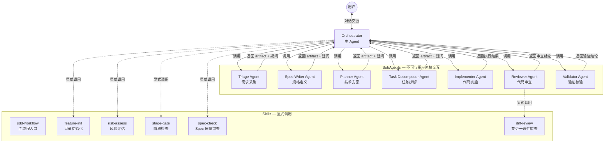
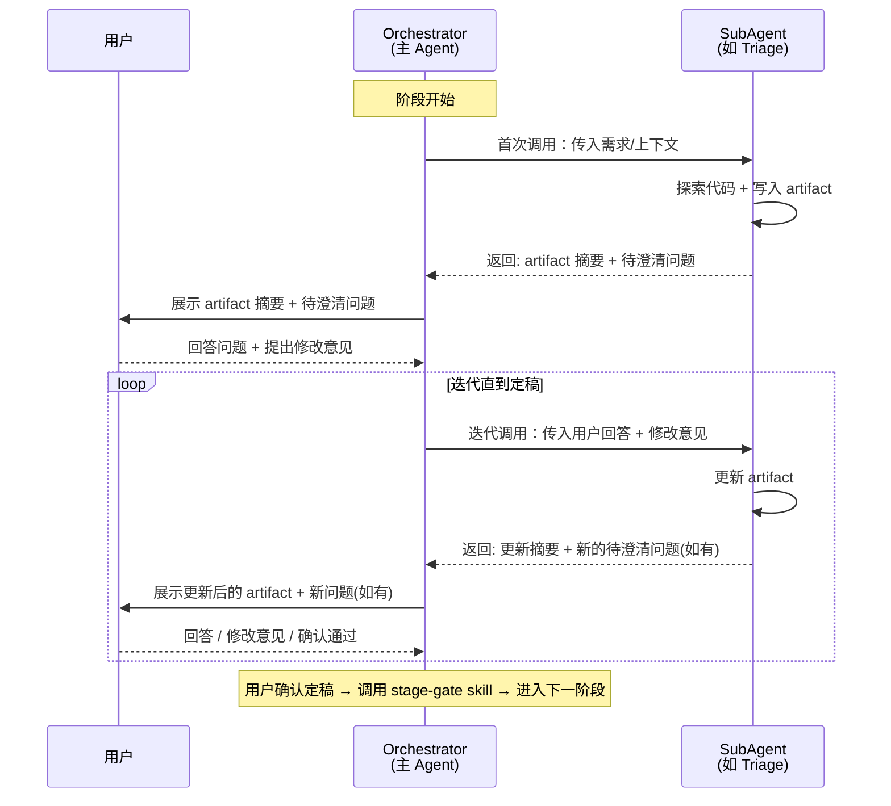
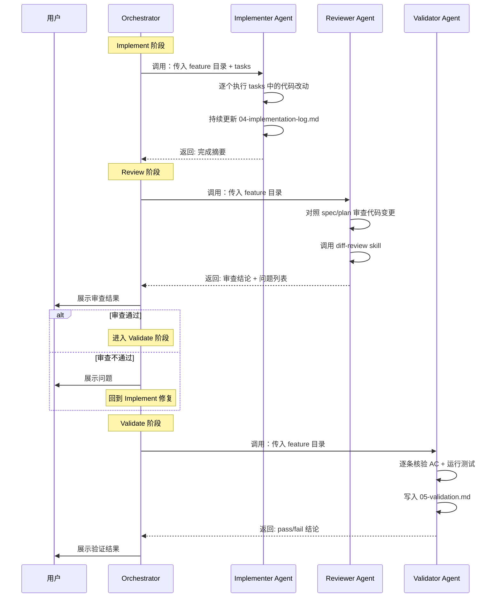
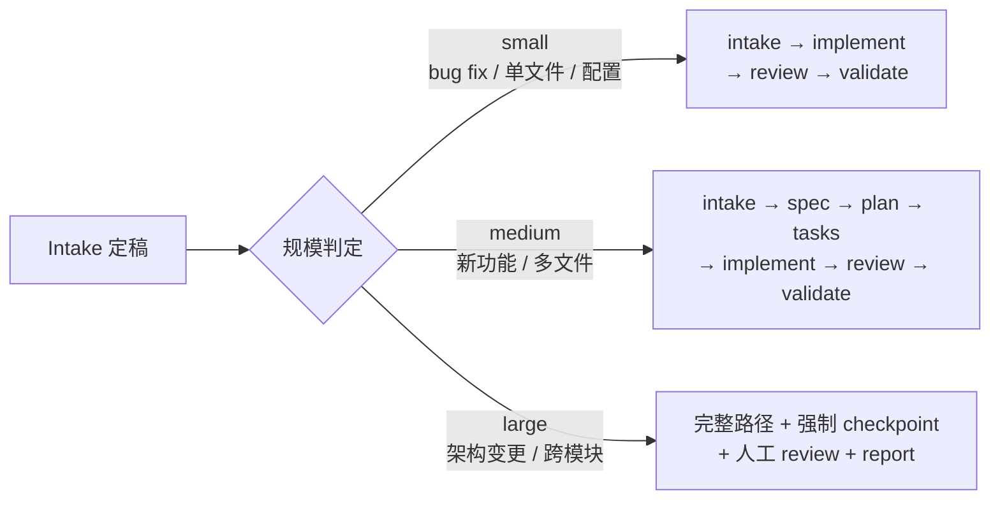
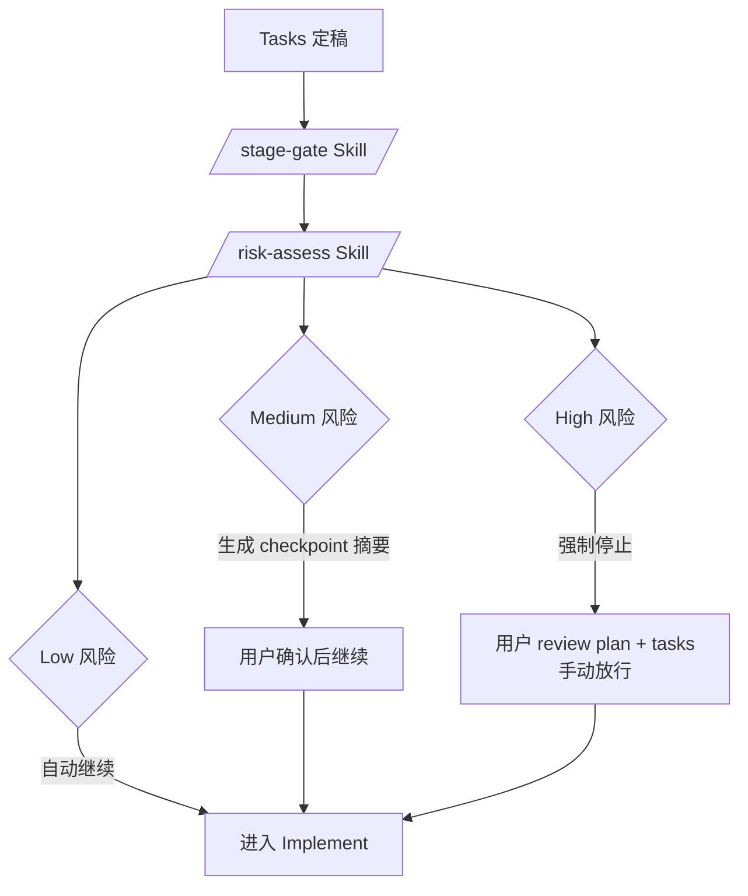

# 架构说明

本文档描述 OpenCode SDD Pipeline 的内部架构。

---

## 系统架构总览



---

## 完整工作流程

```mermaid
flowchart TD
    Start([用户提出需求]) --> Init[/feature-init Skill/]
    Init --> Intake[Intake 阶段<br/>Triage Agent 迭代循环]
    Intake --> IntakeDone{用户定稿?}
    IntakeDone -->|否, 有修改意见| Intake
    IntakeDone -->|是| SG1[/stage-gate Skill/]
    SG1 --> Route{规模路由}

    Route -->|small| SG4[/stage-gate Skill/]
    Route -->|medium / large| SpecPhase[Spec 阶段<br/>Spec Writer Agent 迭代循环]

    SpecPhase --> SC[/spec-check Skill/]
    SC --> SpecDone{用户定稿?}
    SpecDone -->|否| SpecPhase
    SpecDone -->|是| SG2[/stage-gate Skill/]
    SG2 --> PlanPhase[Plan 阶段<br/>Planner Agent 迭代循环]

    PlanPhase --> PlanDone{用户定稿?}
    PlanDone -->|否| PlanPhase
    PlanDone -->|是| SG3[/stage-gate Skill/]
    SG3 --> TaskPhase[Tasks 阶段<br/>Task Decomposer Agent 迭代循环]

    TaskPhase --> TaskDone{用户定稿?}
    TaskDone -->|否| TaskPhase
    TaskDone -->|是| SG4

    SG4[/stage-gate Skill/] --> Checkpoint[/risk-assess Skill/]
    Checkpoint --> RiskLevel{风险等级}
    RiskLevel -->|Low| ImplPhase
    RiskLevel -->|Medium| UserConfirm{用户确认<br/>checkpoint?}
    RiskLevel -->|High| ForceReview[强制停止<br/>用户 review plan + tasks]
    UserConfirm -->|确认| ImplPhase
    ForceReview -->|放行| ImplPhase

    ImplPhase[Implement 阶段<br/>Implementer Agent 执行] --> ReviewPhase[Review 阶段<br/>Reviewer Agent 审查<br/>内部调用 diff-review Skill]
    ReviewPhase --> ReviewResult{审查结论}
    ReviewResult -->|通过| ValidPhase
    ReviewResult -->|需要修改| ImplPhase

    ValidPhase[Validate 阶段<br/>Validator Agent 验证] --> ValidResult{验证结论}
    ValidResult -->|通过| IsLarge{是 large 任务?}
    ValidResult -->|有条件通过| IsLarge
    ValidResult -->|不通过| ImplPhase

    IsLarge -->|是| Report[生成 06-report.md]
    IsLarge -->|否| Done([Workflow 完成])
    Report --> Done
```



---

## 迭代循环模式（核心交互模型）

Intake、Spec、Plan、Tasks 四个阶段都使用相同的**迭代循环**模式。SubAgent 每次调用都会写入/更新 artifact 并返回待澄清问题，Orchestrator 负责在 SubAgent 和用户之间来回传递，直到双方都没有问题为止。



**定稿条件**：SubAgent 没有更多疑问 **且** 用户明确表示没有问题。只要任一方仍有疑问或修改意见，循环就继续。

---

## SubAgent 超步数续接机制

当 SubAgent 因超出最大步数（steps 上限）退出时，Orchestrator **不可自己接手执行**，必须启动新的同类型 SubAgent 续接。


---

## 执行型 SubAgent 交互模型

Implementer、Reviewer、Validator 是**执行型** SubAgent，不走迭代循环，而是执行完毕后一次性返回结果。



---

## SubAgent 一览

| Agent | 类型 | 职责 | 产出 | Steps |
|-------|------|------|------|-------|
| **Triage** | 迭代型 | 需求采集、规模判定 | `00-intake.md` | 50 |
| **Spec Writer** | 迭代型 | 功能规格定义 | `01-spec.md` | 50 |
| **Planner** | 迭代型 | 技术方案设计 | `02-plan.md` | 50 |
| **Task Decomposer** | 迭代型 | 任务拆解（INVEST 原则） | `03-tasks.md` | 50 |
| **Implementer** | 执行型 | 代码实施 | `04-implementation-log.md` + 代码变更 | 200 |
| **Reviewer** | 执行型 | 代码审查（调用 `diff-review`） | 审查结论 | 50 |
| **Validator** | 执行型 | 验收标准核验 + 测试 | `05-validation.md` | 50 |

---

## Skill 一览

| Skill | 调用者 | 调用时机 | 调用条件 | 用户可触发 |
|-------|--------|---------|---------|:---:|
| **sdd-workflow** | 用户 | 启动 SDD 流程 | 用户输入 `/sdd-workflow` | 是 |
| **feature-init** | Orchestrator / 用户 | Workflow 启动初期 | 无 | 是 |
| **stage-gate** | Orchestrator | 每次阶段切换前 | 每次切换必须调用 | 否 |
| **spec-check** | Orchestrator | Spec Agent 产出后 | 规模 >= medium | 否 |
| **risk-assess** | Orchestrator | 进入 Implement 前 | `stage-gate` 通过后 | 否 |
| **diff-review** | Reviewer Agent | Review 阶段审查过程中 | Implement 完成后 | 否 |

---

## 规模路由

Triage Agent 在 Intake 阶段评估任务规模，决定后续走哪条路径。用户可以覆盖 Agent 的判断。



---

## Stage Gate 机制

每个阶段切换前，Orchestrator 显式调用 `stage-gate` Skill 检查前置条件。不满足条件不允许进入下一阶段。

| 从 | 到 | 前置条件 |
|----|-----|---------|
| Intake | Spec | `00-intake.md` 用户已定稿，规模 >= medium |
| Intake | Implement | `00-intake.md` 用户已定稿，规模 = small |
| Spec | Plan | `01-spec.md` 用户已定稿 |
| Plan | Tasks | `02-plan.md` 用户已定稿 |
| Tasks | Implement | `03-tasks.md` 用户已定稿 + checkpoint 通过 |
| Implement | Review | `04-implementation-log.md` 已生成 |
| Review | Validate | Reviewer 审查通过或用户确认 |
| Validate (fail) | Implement | 重新进入修复 |
| Validate (pass) | Report | 仅 large 任务 |

---

## 风险评估 Checkpoint

进入 Implement 前，Orchestrator 显式调用 `risk-assess` Skill 评估风险。



**评估维度**：变更文件数量、核心模块影响、数据变更、外部依赖、不可逆操作。

---

## 关键约束

- SubAgent **不能**与用户直接交互——所有用户沟通由 Orchestrator 代理
- Orchestrator **不可**直接修改 SubAgent 生成的 artifact——必须将修改意见传给 SubAgent 执行
- Orchestrator **不可**自己执行 SubAgent 的工作——SubAgent 超步数退出时必须启动新的同类型 SubAgent 续接
- 所有 Skill 在流程中**显式调用**

---

## 目录结构

```
.opencode/
├── agents/                         # Agent 定义
│   ├── orchestrator.md             # 主 Agent
│   ├── triage.md                   # 需求采集 SubAgent
│   ├── spec-writer.md              # 规格定义 SubAgent
│   ├── planner.md                  # 技术方案 SubAgent
│   ├── task-decomposer.md          # 任务拆解 SubAgent
│   ├── implementer.md              # 代码实施 SubAgent (steps: 200)
│   ├── reviewer.md                 # 代码审查 SubAgent
│   └── validator.md                # 验证核验 SubAgent
├── skills/                         # Skill 定义
│   ├── sdd-workflow/SKILL.md       # 主流程入口（用户可触发）
│   ├── feature-init/SKILL.md       # 目录初始化（用户可触发）
│   ├── risk-assess/SKILL.md        # 风险评估（Orchestrator 调用）
│   ├── stage-gate/SKILL.md         # 阶段检查（Orchestrator 调用）
│   ├── spec-check/SKILL.md         # Spec 质量审查（Orchestrator 调用）
│   └── diff-review/SKILL.md        # 变更一致性审查（Reviewer 调用）
├── templates/                      # Artifact 模板（00-06）
├── AGENTS.md                       # 项目级 Contract
└── docs/                           # 研究与提案文档

features/
└── {id}-{name}/                    # 每个 feature 的产物目录
    ├── 00-intake.md
    ├── 01-spec.md
    ├── 02-plan.md
    ├── 03-tasks.md
    ├── 04-implementation-log.md
    ├── 05-validation.md
    └── 06-report.md                # 可选
```
