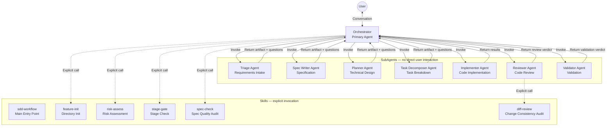
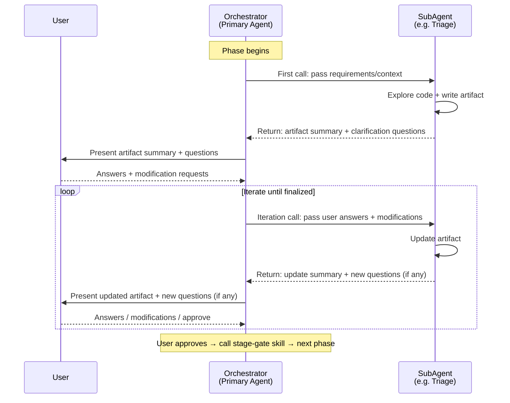
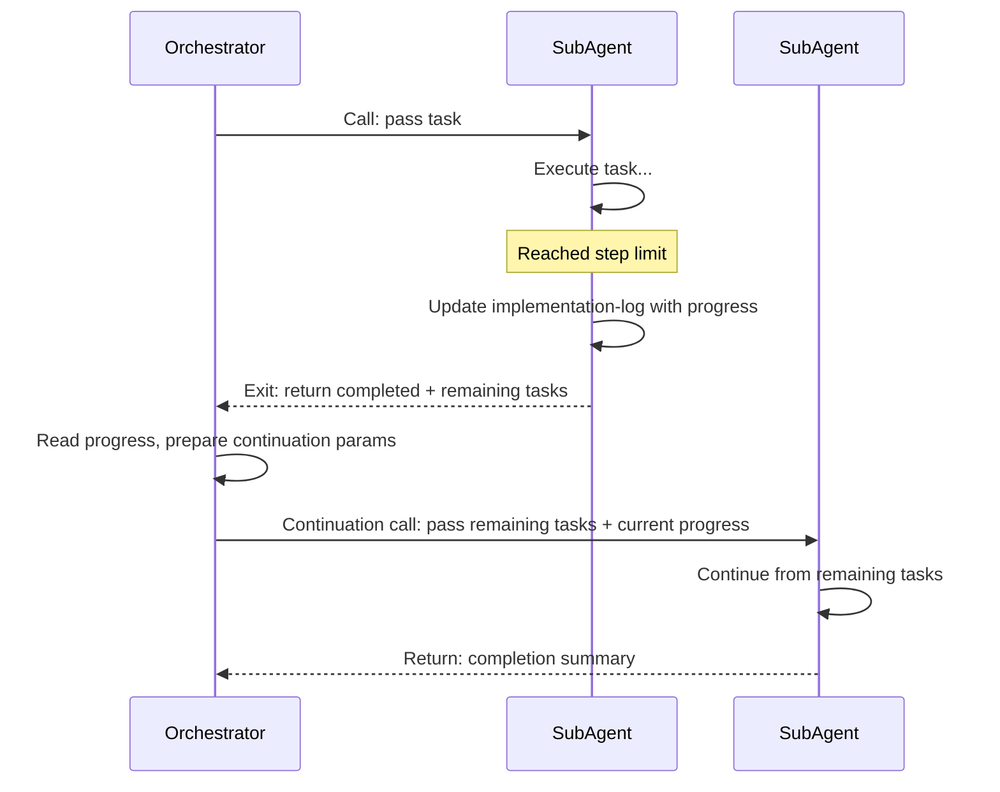
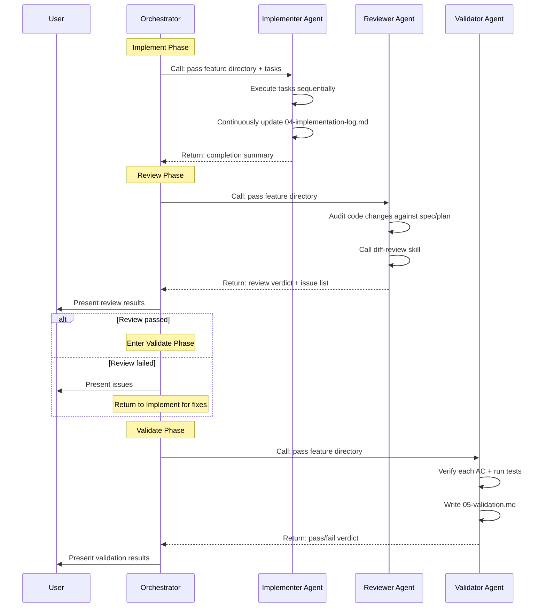
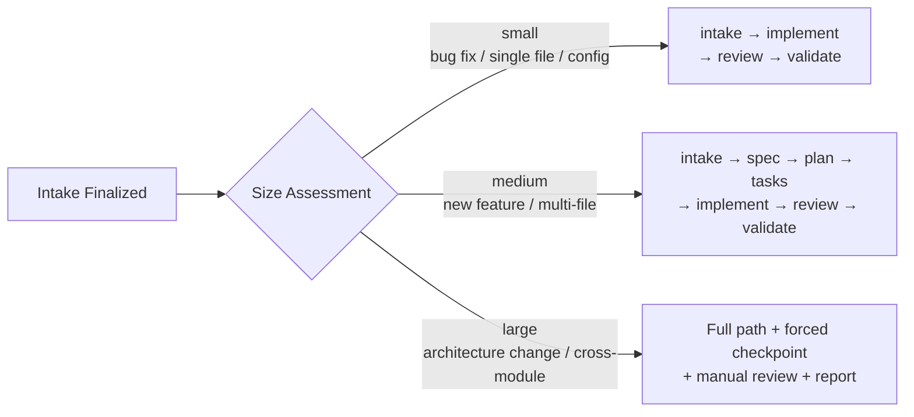
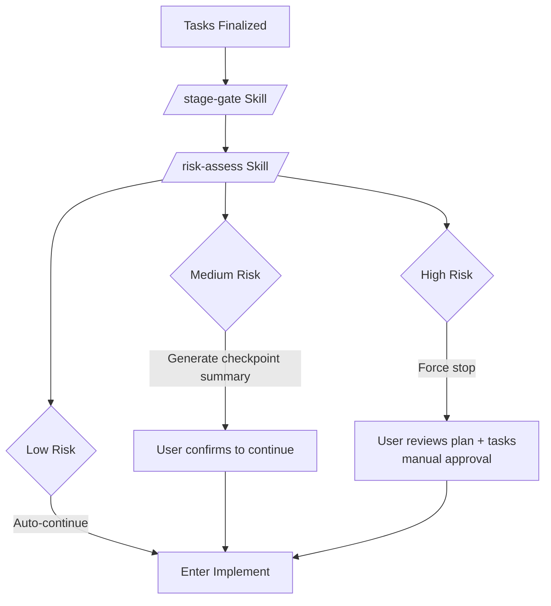

# Architecture

This document describes the internal architecture of the OpenCode SDD Pipeline.

---

## System Overview



---

## Complete Workflow

```mermaid
flowchart TD
    Start([User submits requirement]) --> Init[/feature-init Skill/]
    Init --> Intake[Intake Phase<br/>Triage Agent iterative loop]
    Intake --> IntakeDone{User finalized?}
    IntakeDone -->|No, has feedback| Intake
    IntakeDone -->|Yes| SG1[/stage-gate Skill/]
    SG1 --> Route{Size Routing}

    Route -->|small| SG4[/stage-gate Skill/]
    Route -->|medium / large| SpecPhase[Spec Phase<br/>Spec Writer Agent iterative loop]

    SpecPhase --> SC[/spec-check Skill/]
    SC --> SpecDone{User finalized?}
    SpecDone -->|No| SpecPhase
    SpecDone -->|Yes| SG2[/stage-gate Skill/]
    SG2 --> PlanPhase[Plan Phase<br/>Planner Agent iterative loop]

    PlanPhase --> PlanDone{User finalized?}
    PlanDone -->|No| PlanPhase
    PlanDone -->|Yes| SG3[/stage-gate Skill/]
    SG3 --> TaskPhase[Tasks Phase<br/>Task Decomposer Agent iterative loop]

    TaskPhase --> TaskDone{User finalized?}
    TaskDone -->|No| TaskPhase
    TaskDone -->|Yes| SG4

    SG4[/stage-gate Skill/] --> Checkpoint[/risk-assess Skill/]
    Checkpoint --> RiskLevel{Risk Level}
    RiskLevel -->|Low| ImplPhase
    RiskLevel -->|Medium| UserConfirm{User confirms<br/>checkpoint?}
    RiskLevel -->|High| ForceReview[Force stop<br/>User reviews plan + tasks]
    UserConfirm -->|Confirmed| ImplPhase
    ForceReview -->|Approved| ImplPhase

    ImplPhase[Implement Phase<br/>Implementer Agent] --> ReviewPhase[Review Phase<br/>Reviewer Agent<br/>calls diff-review Skill]
    ReviewPhase --> ReviewResult{Review Verdict}
    ReviewResult -->|Pass| ValidPhase
    ReviewResult -->|Needs changes| ImplPhase

    ValidPhase[Validate Phase<br/>Validator Agent] --> ValidResult{Validation Verdict}
    ValidResult -->|Pass| IsLarge{Is large task?}
    ValidResult -->|Conditional pass| IsLarge
    ValidResult -->|Fail| ImplPhase

    IsLarge -->|Yes| Report[Generate 06-report.md]
    IsLarge -->|No| Done([Workflow Complete])
    Report --> Done
```



---

## Iterative Loop Pattern

The Intake, Spec, Plan, and Tasks phases all follow the same **iterative loop** pattern. The SubAgent writes/updates an artifact and returns clarification questions on each invocation. The Orchestrator relays between the SubAgent and the user until both sides have no remaining questions.



**Finalization condition**: The SubAgent has no more questions **AND** the user explicitly confirms. The loop continues as long as either party has questions or change requests.

---

## SubAgent Step-Limit Continuation

When a SubAgent exits due to exceeding its max step count, the Orchestrator **must not take over** — it launches a new SubAgent of the same type to continue.



---

## Execution-Type SubAgent Interaction

Implementer, Reviewer, and Validator are **execution-type** SubAgents — they don't follow the iterative loop; they execute and return results in one pass.



---

## SubAgent Reference

| Agent | Type | Responsibility | Output | Steps |
|-------|------|---------------|--------|-------|
| **Triage** | Iterative | Requirements intake, size assessment | `00-intake.md` | 50 |
| **Spec Writer** | Iterative | Functional specification | `01-spec.md` | 50 |
| **Planner** | Iterative | Technical design | `02-plan.md` | 50 |
| **Task Decomposer** | Iterative | Task breakdown (INVEST) | `03-tasks.md` | 50 |
| **Implementer** | Execution | Code implementation | `04-implementation-log.md` + code | 200 |
| **Reviewer** | Execution | Code review (calls `diff-review`) | Review verdict | 50 |
| **Validator** | Execution | AC verification + tests | `05-validation.md` | 50 |

---

## Skill Reference

| Skill | Caller | When | Condition | User-invokable |
|-------|--------|------|-----------|:-:|
| **sdd-workflow** | User | Start SDD workflow | User types `/sdd-workflow` | Yes |
| **feature-init** | Orchestrator / User | Workflow start | None | Yes |
| **stage-gate** | Orchestrator | Before each phase transition | Required at every transition | No |
| **spec-check** | Orchestrator | After Spec Agent output | Size >= medium | No |
| **risk-assess** | Orchestrator | Before Implement phase | After `stage-gate` passes | No |
| **diff-review** | Reviewer Agent | During Review phase | After Implement completes | No |

---

## Size Routing

The Triage Agent assesses task size during Intake, which determines the subsequent path. Users can override the agent's assessment.



---

## Stage Gate Mechanism

Before each phase transition, the Orchestrator explicitly calls the `stage-gate` Skill to verify preconditions. Transitions are blocked if any condition is unmet.

| From | To | Preconditions |
|------|----|--------------|
| Intake | Spec | `00-intake.md` finalized, size >= medium |
| Intake | Implement | `00-intake.md` finalized, size = small |
| Spec | Plan | `01-spec.md` finalized |
| Plan | Tasks | `02-plan.md` finalized |
| Tasks | Implement | `03-tasks.md` finalized + checkpoint passed |
| Implement | Review | `04-implementation-log.md` exists |
| Review | Validate | Reviewer approved or user confirmed |
| Validate (fail) | Implement | Re-enter for fixes |
| Validate (pass) | Report | Large tasks only |

---

## Risk Assessment Checkpoint

Before entering the Implement phase, the Orchestrator calls the `risk-assess` Skill.



**Assessment dimensions**: number of changed files, core module impact, data mutations, external dependencies, irreversible operations.

---

## Key Constraints

- SubAgents **cannot** interact with the user directly — all communication goes through the Orchestrator
- The Orchestrator **cannot** modify SubAgent-generated artifacts directly — it must pass modifications back to the SubAgent
- The Orchestrator **cannot** execute SubAgent work itself — when a SubAgent exceeds its step limit, a new SubAgent of the same type must be launched
- All Skills are invoked **explicitly** within the workflow

---

## Directory Layout

```
.opencode/
├── agents/                         # Agent definitions
│   ├── orchestrator.md             # Primary Agent
│   ├── triage.md                   # Requirements intake SubAgent
│   ├── spec-writer.md              # Specification SubAgent
│   ├── planner.md                  # Technical design SubAgent
│   ├── task-decomposer.md          # Task breakdown SubAgent
│   ├── implementer.md              # Implementation SubAgent (steps: 200)
│   ├── reviewer.md                 # Code review SubAgent
│   └── validator.md                # Validation SubAgent
├── skills/                         # Skill definitions
│   ├── sdd-workflow/SKILL.md       # Main entry point (user-invokable)
│   ├── feature-init/SKILL.md       # Directory init (user-invokable)
│   ├── risk-assess/SKILL.md        # Risk assessment (Orchestrator)
│   ├── stage-gate/SKILL.md         # Stage check (Orchestrator)
│   ├── spec-check/SKILL.md         # Spec quality audit (Orchestrator)
│   └── diff-review/SKILL.md        # Change consistency audit (Reviewer)
├── templates/                      # Artifact templates (00–06)
├── docs/                           # Research & proposal docs
├── AGENTS.md                       # Project-level contract
└── README.md

features/
└── {id}-{name}/                    # Per-feature artifact directory
    ├── 00-intake.md
    ├── 01-spec.md
    ├── 02-plan.md
    ├── 03-tasks.md
    ├── 04-implementation-log.md
    ├── 05-validation.md
    └── 06-report.md                # Optional
```
