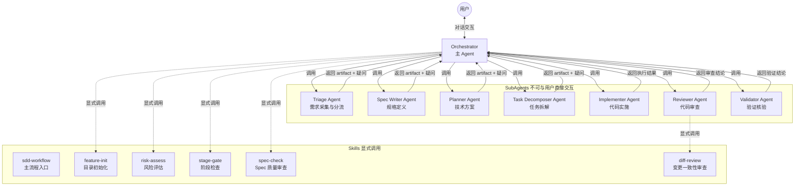
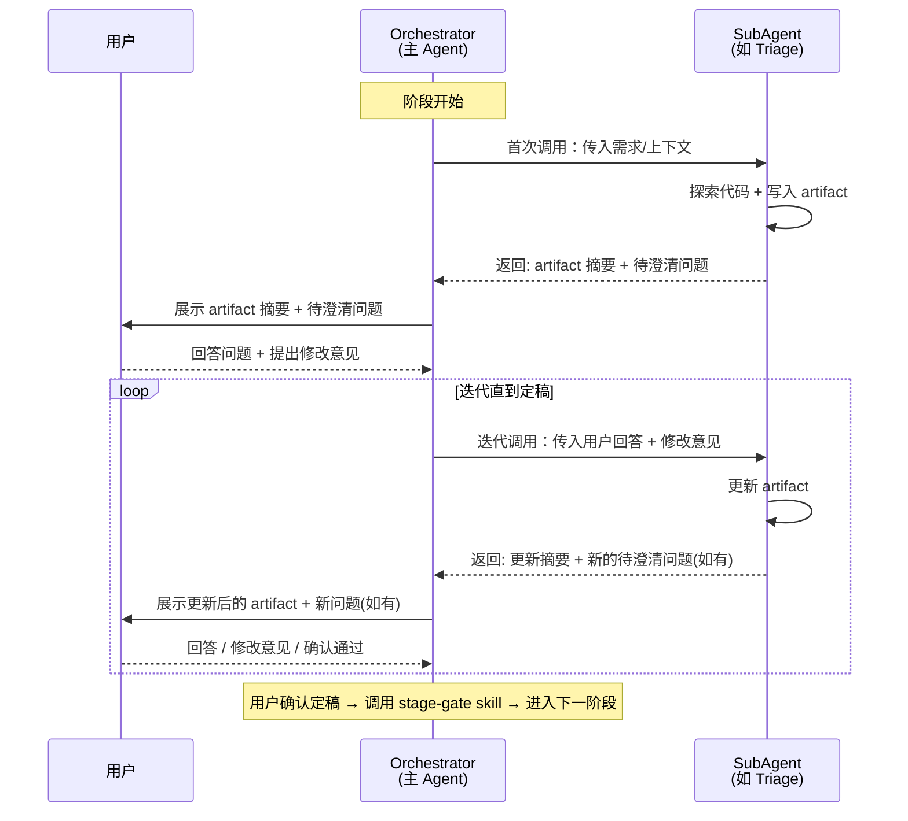
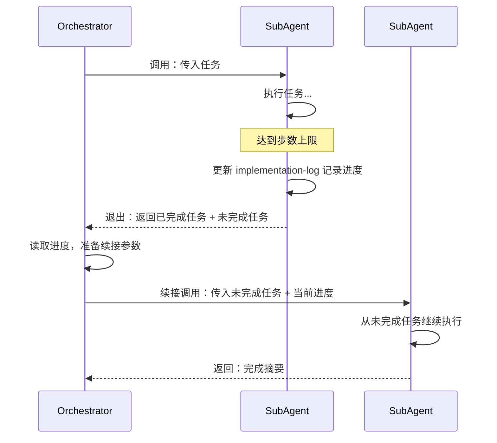
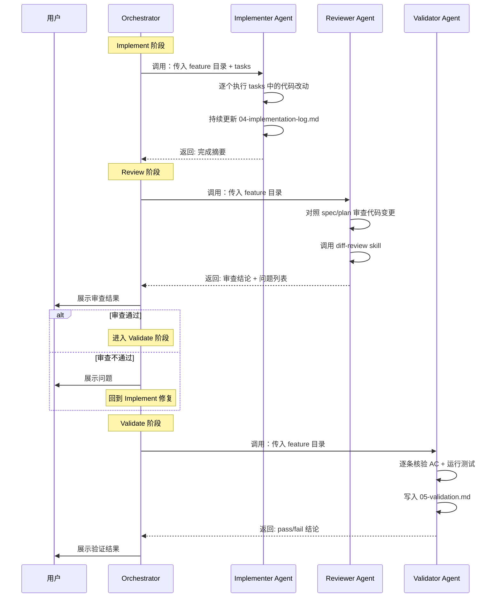
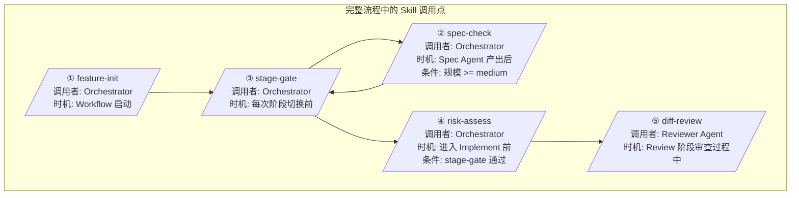
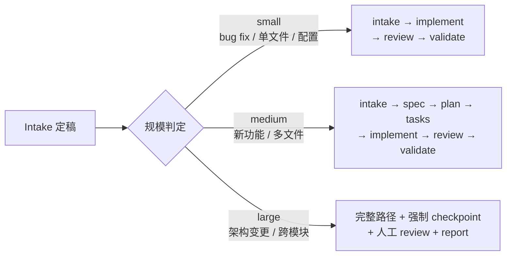
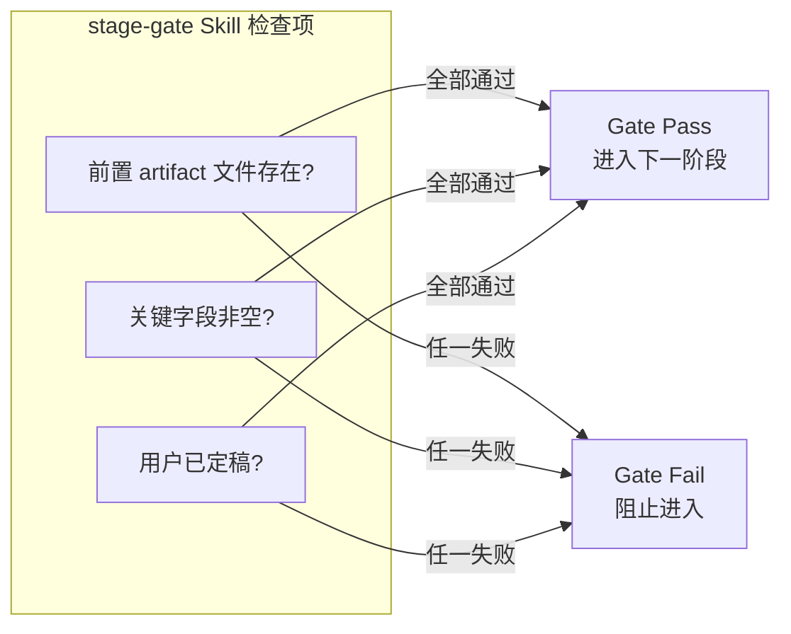
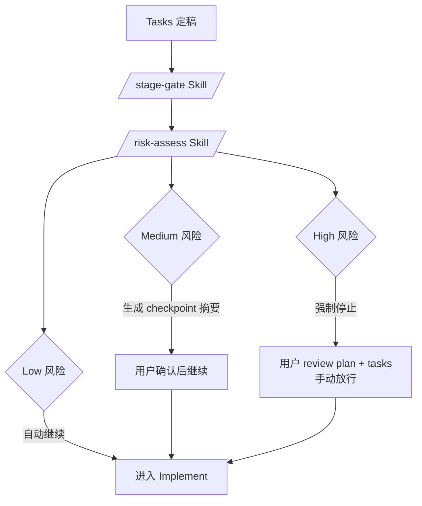

# OpenCode SDD Workflow

基于 **SDD（Spec-Driven Development）** 方法论的 agentic 开发工作流，运行在 [OpenCode](https://opencode.ai) 上。

核心理念：**规范是中枢，产物是事实，流程是约束。**

---

## 系统架构总览



**关键约束**：
- SubAgent 不能与用户直接交互，所有用户沟通由 Orchestrator 代理
- Orchestrator 不可直接修改 SubAgent 生成的 artifact，必须将修改意见传给 SubAgent 执行
- Orchestrator 不可自己执行 SubAgent 的工作，SubAgent 超步数退出时必须启动新的同类型 SubAgent 续接
- 所有 Skill 在流程中显式调用

---

## 完整工作流程

```mermaid
flowchart TD
    Start([用户提出需求]) --> Init[/feature-init Skill/]
    Init --> Intake[Intake 阶段<br/>Triage Agent 迭代循环]
    Intake --> IntakeDone{用户定稿?}
    IntakeDone -->|否, 有修改意见| Intake
    IntakeDone -->|是| SG1[/stage-gate Skill/]
    SG1 --> Route{规模路由}

    Route -->|small| SG4[/stage-gate Skill/]
    Route -->|medium / large| SpecPhase[Spec 阶段<br/>Spec Writer Agent 迭代循环]

    SpecPhase --> SC[/spec-check Skill/]
    SC --> SpecDone{用户定稿?}
    SpecDone -->|否| SpecPhase
    SpecDone -->|是| SG2[/stage-gate Skill/]
    SG2 --> PlanPhase[Plan 阶段<br/>Planner Agent 迭代循环]

    PlanPhase --> PlanDone{用户定稿?}
    PlanDone -->|否| PlanPhase
    PlanDone -->|是| SG3[/stage-gate Skill/]
    SG3 --> TaskPhase[Tasks 阶段<br/>Task Decomposer Agent 迭代循环]

    TaskPhase --> TaskDone{用户定稿?}
    TaskDone -->|否| TaskPhase
    TaskDone -->|是| SG4

    SG4[/stage-gate Skill/] --> Checkpoint[/risk-assess Skill/]
    Checkpoint --> RiskLevel{风险等级}
    RiskLevel -->|Low| ImplPhase
    RiskLevel -->|Medium| UserConfirm{用户确认<br/>checkpoint?}
    RiskLevel -->|High| ForceReview[强制停止<br/>用户 review plan + tasks]
    UserConfirm -->|确认| ImplPhase
    ForceReview -->|放行| ImplPhase

    ImplPhase[Implement 阶段<br/>Implementer Agent 执行] --> ReviewPhase[Review 阶段<br/>Reviewer Agent 审查<br/>内部调用 diff-review Skill]
    ReviewPhase --> ReviewResult{审查结论}
    ReviewResult -->|通过| ValidPhase
    ReviewResult -->|需要修改| ImplPhase

    ValidPhase[Validate 阶段<br/>Validator Agent 验证] --> ValidResult{验证结论}
    ValidResult -->|通过| IsLarge{是 large 任务?}
    ValidResult -->|有条件通过| IsLarge
    ValidResult -->|不通过| ImplPhase

    IsLarge -->|是| Report[生成 06-report.md]
    IsLarge -->|否| Done([Workflow 完成])
    Report --> Done
```



---

## 迭代循环模式（核心交互模型）

Intake / Spec / Plan / Tasks 四个阶段都使用相同的**迭代循环**模式。SubAgent 每次调用都会写入/更新 artifact 并返回待澄清问题，Orchestrator 负责在 SubAgent 和用户之间来回传递，直到双方都没有问题为止。



**定稿条件**：SubAgent 没有更多疑问 **且** 用户明确表示没有问题。只要任一方仍有疑问或修改意见，循环就继续。

---

## SubAgent 超步数续接机制

当 SubAgent 因超出最大步数（steps 上限）退出时，Orchestrator **不可自己接手执行**，必须启动新的同类型 SubAgent 续接。



---

## 执行型 SubAgent 交互模型

Implementer、Reviewer、Validator 是**执行型** SubAgent，不走迭代循环，而是执行完毕后一次性返回结果。



---

## SubAgent 详细说明

### Triage Agent（迭代型）

- **功能**：接收原始需求，结构化为 intake 文档，评估任务规模（small/medium/large），识别待澄清项
- **调用时机**：Workflow 启动，用户提出新需求
- **输出**：`00-intake.md` + 待澄清问题 + 规模判定
- **Steps**：50
- **调用的 Skill**：无

---

### Spec Writer Agent（迭代型）

- **功能**：根据 intake 编写功能规格定义，定义"做什么"和"为什么做"，确保验收标准可测试、边界情况已识别
- **调用时机**：Intake 定稿后（仅 medium/large 任务）
- **输出**：`01-spec.md` + 待澄清问题
- **Steps**：50
- **调用的 Skill**：无（Orchestrator 在 Spec 产出后调用 `spec-check` skill）

---

### Planner Agent（迭代型）

- **功能**：根据 spec 制定技术方案，定义"怎么做"，识别涉及模块、接口契约、实现顺序、风险与取舍
- **调用时机**：Spec 定稿后
- **输出**：`02-plan.md` + 待澄清问题 + 技术取舍
- **Steps**：50
- **调用的 Skill**：无

---

### Task Decomposer Agent（迭代型）

- **功能**：将 plan 拆解为 agent 可执行的离散小任务（INVEST 原则），定义依赖关系和完成标准
- **调用时机**：Plan 定稿后
- **输出**：`03-tasks.md` + 待澄清问题 + 粒度建议
- **Steps**：50
- **调用的 Skill**：无

---

### Implementer Agent（执行型）

- **功能**：按照 tasks 逐个执行代码改动，持续更新 implementation-log，遵守 scope 约束
- **调用时机**：Tasks 定稿 + `stage-gate` skill 通过 + `risk-assess` skill checkpoint 通过后
- **前置 Skill 调用**（由 Orchestrator 执行）：
  - `stage-gate`：检查 `03-tasks.md` 已定稿
  - `risk-assess`：评估风险等级，medium/high 需用户确认
- **输出**：`04-implementation-log.md` + 代码变更 + 完成摘要
- **Steps**：200（支持复杂任务）
- **超步数处理**：优先更新 implementation-log 记录进度后退出，Orchestrator 启动新 Implementer 续接
- **调用的 Skill**：无

---

### Reviewer Agent（执行型）

- **功能**：在 implement 完成后，审查代码变更是否符合 spec 和 plan 中的设计，检查代码质量和一致性
- **调用时机**：Implement 完成，用户审核通过后
- **输出**：审查结论（通过 / 需要修改 / 不通过）+ 问题列表 + 修改建议
- **Steps**：50
- **调用的 Skill**：
  - `diff-review`：Reviewer 在审查过程中调用，检查代码变更与 spec/tasks 的一致性

---

### Validator Agent（执行型）

- **功能**：逐条核验 spec 验收标准，运行测试命令，检查 spec-实现一致性，给出明确的 pass/fail 结论
- **调用时机**：Reviewer 审查通过后
- **输出**：`05-validation.md` + pass/fail 结论 + 问题列表
- **Steps**：50
- **调用的 Skill**：无

---

## Skill 调用时机与条件



| Skill | 调用者 | 调用时机 | 调用条件 | 是否用户可触发 |
|-------|--------|---------|---------|:---:|
| **sdd-workflow** | 用户 | 启动 SDD 流程 | 用户输入 `/sdd-workflow` | 是 |
| **feature-init** | Orchestrator / 用户 | Workflow 启动初期 | 无 | 是 |
| **stage-gate** | Orchestrator | 每次阶段切换前 | 无（每次切换必须调用） | 否 |
| **spec-check** | Orchestrator | Spec Agent 产出 `01-spec.md` 后 | 规模 >= medium（即有 Spec 阶段时） | 否 |
| **risk-assess** | Orchestrator | 进入 Implement 前 | `stage-gate` 通过后 | 否 |
| **diff-review** | Reviewer Agent | Review 阶段审查过程中 | Implement 完成后 | 否 |

---

## 规模路由

Triage Agent 在 Intake 阶段评估任务规模，决定后续走哪条路径。用户可以覆盖 Agent 的判断。



---

## Stage Gate 机制

每个阶段切换前，Orchestrator 显式调用 `stage-gate` Skill 检查前置条件。不满足条件不允许进入下一阶段。



| 从 | 到 | 前置条件 |
|----|-----|---------|
| Intake | Spec | `00-intake.md` 用户已定稿，规模 >= medium |
| Intake | Implement | `00-intake.md` 用户已定稿，规模 = small |
| Spec | Plan | `01-spec.md` 用户已定稿 |
| Plan | Tasks | `02-plan.md` 用户已定稿 |
| Tasks | Implement | `03-tasks.md` 用户已定稿 + checkpoint 通过 |
| Implement | Review | `04-implementation-log.md` 已生成 |
| Review | Validate | Reviewer 审查通过或用户确认 |
| Validate (fail) | Implement | 重新进入修复 |
| Validate (pass) | Report | 仅 large 任务建议 |

---

## Implement Checkpoint 机制

进入 Implement 前，Orchestrator 显式调用 `risk-assess` Skill 评估风险。



**评估维度**：变更文件数量、核心模块影响、数据变更、外部依赖、不可逆操作。

---

## 目录结构

```
.opencode/
├── agents/                         # Agent 定义
│   ├── orchestrator.md             # 主 Agent（primary）
│   ├── triage.md                   # 需求采集 SubAgent
│   ├── spec-writer.md              # 规格定义 SubAgent
│   ├── planner.md                  # 技术方案 SubAgent
│   ├── task-decomposer.md          # 任务拆解 SubAgent
│   ├── implementer.md              # 代码实施 SubAgent (steps: 200)
│   ├── reviewer.md                 # 代码审查 SubAgent
│   └── validator.md                # 验证核验 SubAgent
├── skills/                         # Skill 定义
│   ├── sdd-workflow/SKILL.md       # 主流程入口（用户可触发）
│   ├── feature-init/SKILL.md       # 目录初始化（用户可触发）
│   ├── risk-assess/SKILL.md        # 风险评估（Orchestrator 调用）
│   ├── stage-gate/SKILL.md         # 阶段检查（Orchestrator 调用）
│   ├── spec-check/SKILL.md         # Spec 质量审查（Orchestrator 调用）
│   └── diff-review/SKILL.md        # 变更一致性审查（Reviewer 调用）
├── templates/                      # Artifact 模板（00-06）
├── docs/                           # 研究与提案文档
├── AGENTS.md                       # 项目级 Contract
└── README.md                       # 本文件

features/
└── {id}-{name}/                    # 每个 feature 的产物目录
    ├── 00-intake.md
    ├── 01-spec.md
    ├── 02-plan.md
    ├── 03-tasks.md
    ├── 04-implementation-log.md
    ├── 05-validation.md
    └── 06-report.md                # 可选
```

---

## 快速开始

```bash
# 启动 SDD 工作流
/sdd-workflow 实现一个用户搜索功能，支持关键词匹配和结果排序

# 或手动初始化 feature 目录
/feature-init 001 user-search
```

---

## 核心规则

1. **Artifact-first** — 所有阶段产出必须落到文件，不依赖会话记忆
2. **Stage-gated** — 阶段按顺序推进，切换前必须调用 `stage-gate` skill 检查
3. **用户定稿制** — 每个 artifact 必须用户明确确认后才能进入下一阶段
4. **SubAgent 不直接与用户交互** — 所有用户沟通通过 Orchestrator 代理
5. **Orchestrator 不直接修改 artifact** — 修改必须通过对应 SubAgent 执行
6. **Orchestrator 不代替 SubAgent 执行** — SubAgent 超步数退出时启动新的同类型 SubAgent 续接
7. **Skill 显式调用** — 所有 Skill 在流程中显式调用，不隐式依赖
8. **Implementation-bounded** — 代码实施受 tasks 约束，不超范围
9. **Review + Validate 双重把关** — Reviewer 审查设计一致性，Validator 核验验收标准
10. **Validate 不可跳过** — validate fail 不可视为完成
