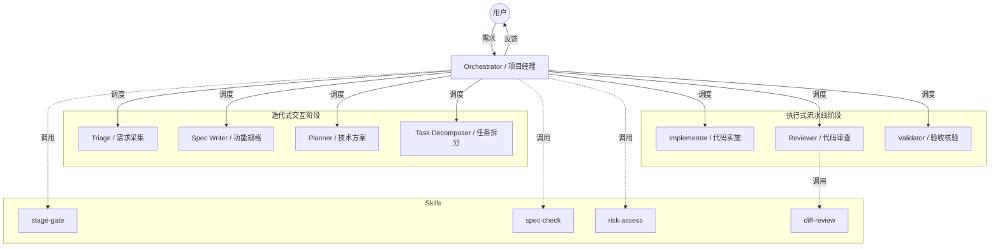
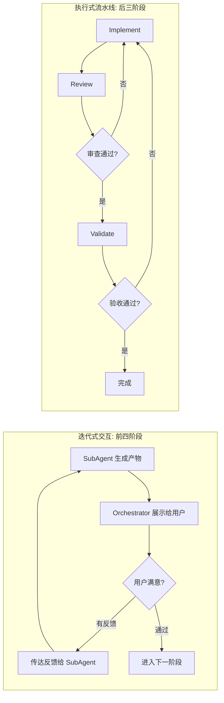
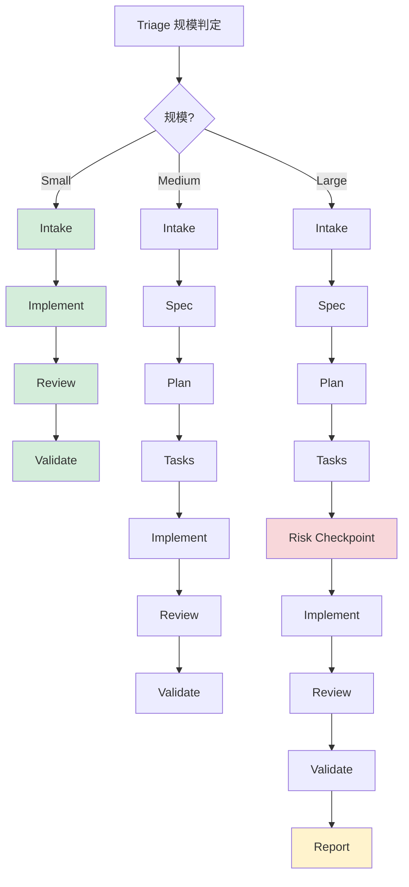
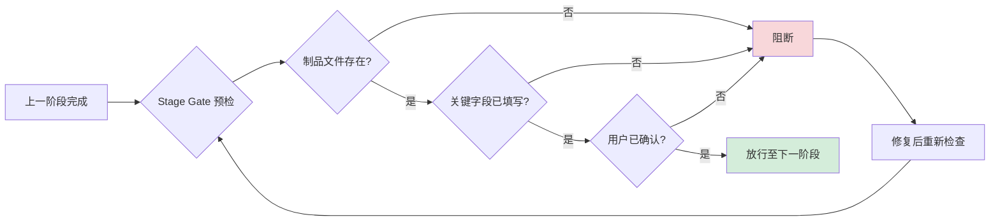
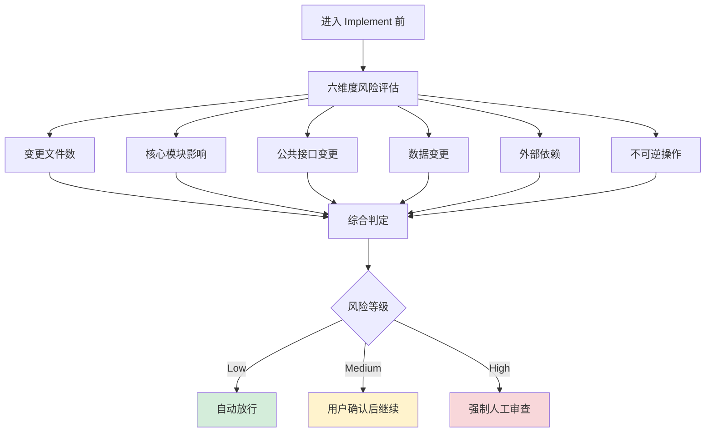

# 让 AI 写代码之前，先教它学会"对齐需求"

## 一、AI 编程，问题出在哪？

### 信息差：人与人都对不齐，何况 AI

你一定经历过这样的场景：花 5 分钟描述了一个需求，AI 唰唰写了 200 行代码，你一看——方向完全跑偏了。

这不是 AI 能力不行。想想你平时和同事对需求的场景：你说"加个导出功能"，你脑子里想的是导出 CSV，他理解成了导出 PDF；你说"性能要好"，你想的是 P99 < 200ms，他以为是"别太慢就行"。人与人之间沟通尚且如此——要不然也不会出现功能上线后互相扯皮的事——何况 AI 呢？

沟通一定存在信息差，这不是 bug，这是现实。问题是我们有没有一套机制来管理这个信息差。

### 一股脑往前冲：AI 不会自己踩刹车

人和人沟通出了偏差，好歹还能扯扯皮找到哪里理解错了。但 AI 写代码是不回头的——它不会中途停下来问你"你确定是这个意思吗？"。等你发现问题，它可能已经改了 15 个文件，偏得太远只能从头再来。

更糟的是：如果没有中间产物，你甚至说不清是哪一步开始跑偏的。是需求没说清楚？理解错了？还是实现的时候走样了？全凭感觉。

所以核心问题不是"AI 写不好代码"，而是**没有一个机制让 AI 在动手之前先和你对齐，出了问题还能定位到是哪一环**。

## 二、SDD：一个旧思路的新用法

### 什么是 SDD

SDD（Spec-Driven Development，规格驱动开发）不是我们发明的新概念。它的核心思路很朴素：**先写规格，再写代码，最后用规格去验收代码**。

听起来很重？其实逻辑很简单：你去装修房子，不会直接让工人开干，而是先出设计图，确认之后再施工，完工后按图验收。SDD 只是把这套常识搬到了软件开发里。

### 我们是怎么走到这条路上的

在动手之前，我们先做了三件事：盘点 OpenCode 平台的能力边界（它能做什么、不能做什么），研究主流 SDD 实践（看看别人踩了哪些坑），最后整理出一份"应该吸收什么、不该照搬什么"的取舍清单。这三份研究文档最终汇成了一份 v1 提案，才开始写第一行 prompt。

在研究过程中，几个方向对我们影响最大：

- **SDD 方法论**——提出"规范不是文档，而是工作中枢"的观点。这句话直接影响了我们的设计：制品不是附属产物，而是整个工作流的骨架
- **Microsoft SpecKit**——强调 spec 必须可审阅、可讨论、可否决
- **OpenSpec**——提出规范的审计链路思想：当前事实是什么、这次想改什么、为什么改、改完如何归档

### 吸收了什么，没照搬什么

一句话概括：**吸收"规范中心、阶段化、规则显式化"的思想，但不照搬那些偏重型、偏大一统的实现方式。**

- **吸收了**：规范作为唯一真相源、阶段分离、制品可审阅、实现前对齐、验证闭环、审计链路
- **没照搬**：过重的命令体系、过多模板层级、为了"完整"而引入的文档膨胀

因为如果不做取舍，SDD 很容易退化成——用研究文档里的原话说——"先让 AI 帮我写一篇大文档，然后继续 vibe coding"。那就没意义了。

### 两个关键判断

在研究过程中，有两个判断奠定了整个方案的基调：

**规范是中枢，不是附件。** 很多团队写 spec 的方式是"先聊清楚需求，顺便记个文档"，文档只是副产品，真正驱动工作的还是脑子里的理解。但 AI 没有"脑子里的理解"——它只有你写下来的东西。所以在 AI 协作中，写下来的规范本身就是工作的中枢，不是走形式。

**OpenCode 是 runtime，不是流程本身。** OpenCode 提供了 Agent、SubAgent、Skill、权限控制这些能力，但它不会替你规定工作流应该长什么样。真正的流程由我们自己定义，OpenCode 只是执行这个流程的引擎。理解这一点很重要——我们不是在"配置一个现成的系统"，而是在"设计一套流程，然后让 OpenCode 跑起来"。

## 三、两个核心设计决策

### 强约束：用制品定界，用确认对齐

我们给工作流加了两条硬规则：

**所有中间产物必须落盘为文件。** 需求理解、功能规格、技术方案、任务清单、实施记录、验证报告——每个阶段都输出一份结构化的 Markdown 文档。这不是形式主义，而是为了**定界**：最终结果出了问题，你可以沿着这条制品链路往回追，精确定位是需求没说清、规格写错了、还是实现偏了。有了制品，复盘就不靠"感觉"了，迭代工作流也有了明确的抓手。

**每个阶段必须经过用户确认才能继续。** Agent 写完产物后会停下来，把理解和疑问交给你确认。有问题就改，没问题再往下走。这样做是因为沟通的信息差是必然存在的，与其让 agent 的误解越走越远、最后返工回到起点，不如在每一步都对齐一次。短期看慢了一点，长期看省了大量返工。

### 轻量化：先搭骨架，再填肌肉

坦白说，目前公司内部可用的模型在指令遵循、项目理解、代码编写能力上都还有差距。用现有模型直接搭一个功能完备的全自动工作流，不现实。

所以我们的策略是：**先用轻量化的方式把流程骨架搭起来，用强约束弥补模型能力的不足。**

当前整套工作流是纯 Markdown 定义的——没有额外依赖，没有自研框架，Agent 行为全靠 prompt 约束。调整一个阶段的行为，就是改一个 `.md` 文件。

这样做的好处是演进成本极低。后续模型能力提升时，我们可以逐步往 Skill 和 SubAgent 里注入更强的业务逻辑，而不需要推翻重来。先跑通流程、再打磨细节——这比一步到位务实得多。

## 四、架构与关键机制

### 一个项目经理带七个专家

整套系统由 1 个 Orchestrator + 7 个 SubAgent + 6 个 Skill 组成。

Orchestrator 是"项目经理"——调度 SubAgent、转达用户反馈、把控阶段流转，但**绝不亲自动手改任何产物**。这个约束很重要：职责一旦混淆，出了问题分不清是谁的锅。

7 个 SubAgent 各管一段，每个 Agent 都有明确的产出文件和职责边界：

| Agent | 产出 | 核心职责 |
|-------|------|---------|
| Triage | `00-intake.md` | 需求采集 + 规模判定 |
| Spec Writer | `01-spec.md` | 功能规格 + 验收标准 |
| Planner | `02-plan.md` | 技术方案 + 风险评估 |
| Task Decomposer | `03-tasks.md` | 原子任务拆分（INVEST 原则） |
| Implementer | 代码 + `04-implementation-log.md` | 按任务清单逐项实施 |
| Reviewer | 审查结论 | 代码与规格一致性审查 |
| Validator | `05-validation.md` | 逐条验收标准核验 |

其中前四个阶段（intake → spec → plan → tasks）采用**迭代式交互**：Agent 生成产物 → Orchestrator 展示给用户 → 用户给反馈 → Agent 修改 → 循环直到用户满意。后三个阶段（implement → review → validate）采用**执行式流水线**：单向推进，失败则回退到 implement 重做。

### 规模路由：不是所有任务都走全流程

Triage 阶段会判定任务规模（small / medium / large），不同规模走不同路径：

- **Small**：intake → 直接实施 → 审查 → 验证（跳过 spec/plan/tasks）
- **Medium**：完整流程
- **Large**：完整流程 + 强制风险检查点 + 最终复盘报告 `06-report.md`

改个按钮文案和重构认证模块，不该用同一套流程。

### Stage Gate：阶段之间的"闸门"

这是整套工作流最核心的管控机制。每次阶段切换前，Orchestrator 调用 `stage-gate` Skill 做预检，必须同时满足三个条件：

1. **前置制品文件存在**——没有 intake 就不能进 spec
2. **关键字段已填写**——不是走个形式生成空模板就能过关
3. **用户已确认**——未经确认的产物不能作为下一阶段的输入

任何一项不通过，流程就停在这里。就像工厂产线上的质检站——半成品不合格，绝不放行到下一道工序。

### Risk Assess：动手前的最后一道防线

进入 Implement 之前，还有一次六维度风险评估——变更文件数、核心模块影响、公共接口变更、数据变更、外部依赖、不可逆操作。每个维度独立打分 low/medium/high，综合判定后：

- **Low**：自动放行
- **Medium**：用户确认后继续
- **High**：强制停下来，等人工审查

这避免了 AI 在高风险场景下"闷头蛮干"。

### Diff Review：你改多了，还是改少了？

Reviewer 审查代码时调用 `diff-review` Skill，把实际代码变更和 `03-tasks.md` 定义的范围做交叉比对：

- 改了任务里没提到的文件？→ **越界**
- 任务要改的文件没改？→ **遗漏**
- 引入了 spec 里没有的功能？→ **镀金**

不靠 AI "自我感觉良好"来判断，而是用制品之间的一致性做硬核检查。

## 五、案例演示

> *（以下为框架，将用实际跑通的 feature 填充）*

### 5.1 需求描述

<!-- 原始需求文本 -->

### 5.2 Intake 阶段

<!-- 00-intake.md 的关键内容，规模判定结果 -->

### 5.3 Spec → Plan → Tasks

<!-- 各阶段产物的关键摘要，重点展示：用户在哪里给了反馈、AI 做了什么调整 -->

### 5.4 实施与验证

<!-- 实施过程、审查结论、验证结果 -->

### 5.5 回顾

<!-- 整个流程中哪些地方人介入了，哪些地方是自动流转的 -->

## 六、总结

这套工作流的核心不是"让 AI 变强"，而是**给 AI 加护栏**——用制品链路追溯问题，用阶段门控防止跑偏，用多轮对齐弥合沟通的信息差。

它也不是终态。当前是一个轻量骨架，能力上限取决于底层模型。但骨架搭好了，后续模型升级时我们可以逐步填充更强的业务逻辑，而不需要推翻重来。

如果你对 AI 辅助编程的可控性感兴趣，或者想在自己的场景里尝试类似的方案，欢迎找我聊。
